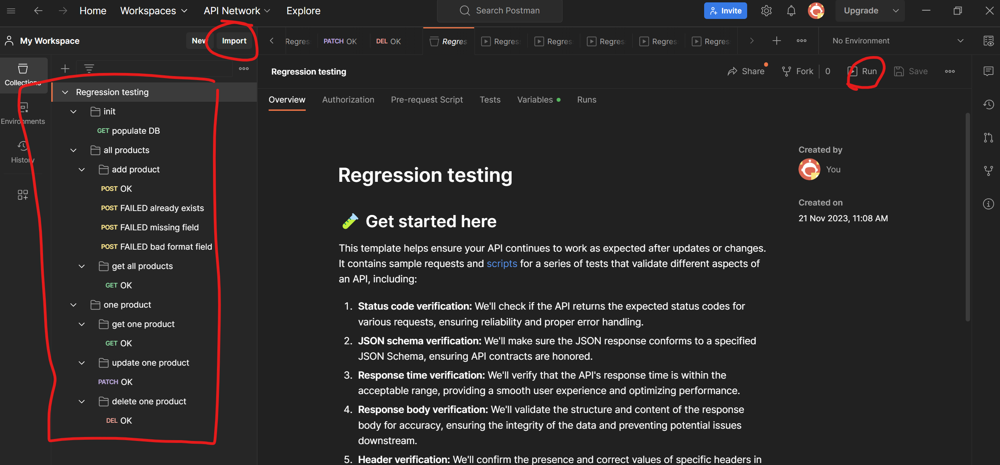
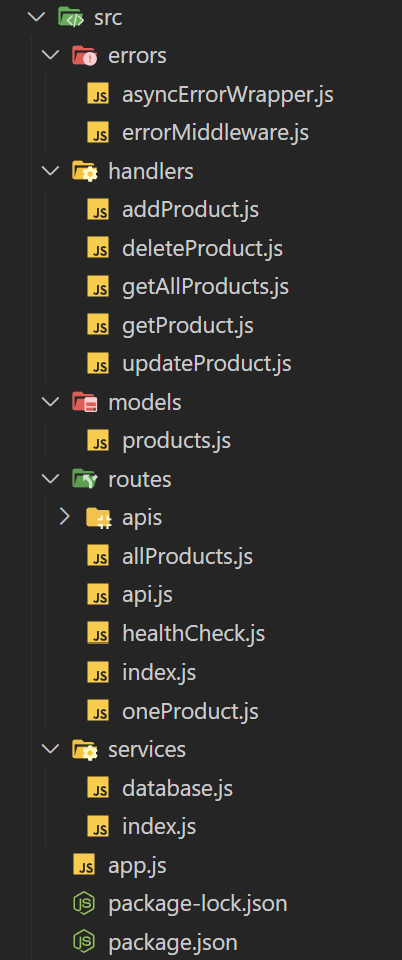

# product_backend

## Specifications
This is a draft product backend based on nodeJS/express and mongoDB.

The backend handles the following REST APIs:
- /products
	- POST: Create a new products
	- GET: Retrieve all products
- /products/productId
	- GET: Retrieve details for product productId
	- PATCH: Update details of product productId if it exists
	- DELETE: Remove product productId

And product is defined as such:
```json
{ 
	id: number,
	code: string,
	name: string,
	description: string,
	price: number,
	quantity: number,
	inventoryStatus: string,
	category: string,
	image?: string,
	rating?: number
}
```

## How to start
In order to start the project, you can use a docker backend and client (or manually install/run node and mongodb).
As I am under windows, I am using docker desktop (that uses wsl to run linux env) as backend and a docker client embedded within my terminal simulator (mobaxterm).

Use this command to run the stack:
`docker-compose up -d` 

It will start:
- a docker container for the app listening on localhost:4567
- a mongodb container listening on localhost:27017
- a docker network to let containers communicate

Use this command to stop the stack:
`docker-compose down`

## How to test
I am using postman (v10.20.0) for a basic non regression testing.
You can find tests/Regression testing.postman_collection.json to be imported within postman and run the campaign.


## Code architecture
This is the current code architecture under /src


- main file is app.js that takes care of booting route and database
- webserver is defined in routes/index.js and API is located in /routes/apis/api.yaml
- REST path/method are processed by /handlers
- errors are handled within /errors
- product object is defined within /models
- /services is here to provides tooling like database, client features...

## At the current state
This app can:
- validate requests (and response) thanks to /routes/apis/api.yaml and NPM express-openapi-validator
- validate DB query thanks to NPM mongoose
- offer a basic healthcheck on 127.0.0.1:4567
- share its api on 127.0.0.1:4567/api.yaml
- handle the specified API (specified up above) on 127.0.0.1:4567/products(/productId)
- lazily manage errors ("catch at top")

This app does not:
- log in a professional way
- offer docker env variable for production deployment (like hostname:port, database url, password...)
- offer https
- offer monitoring in a professional way

## Conclusion
Thanks for reading me